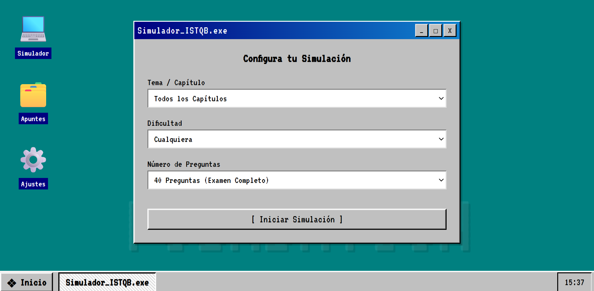

# Simulador ISTQB Foundation (Retro-OS Edition) 🖥️✅

Un simulador de examen interactivo para la certificación **ISTQB Certified Tester Foundation Level (CTFL) v4.0**, construido con React y diseñado con una estética inmersiva de sistema operativo retro (estilo Windows 95/98).



## 🌟 Características Principales

*   **Entorno Retro-OS:** Interfaz inmersiva con ventanas arrastrables, barra de tareas, menú de inicio funcional y un "Panel de Control" para cambiar entre el tema Retro y Moderno.
*   **Gestión de Ventanas Simultáneas:** La pregunta actual y la cuadrícula de navegación se muestran en dos ventanas independientes flotantes.
*   **Banco de 100 Preguntas Oficiales:** Un repositorio extenso que cubre los 6 capítulos del Syllabus v4.0 con sus respectivas explicaciones detalladas.
*   **Motor Aleatorio Real (Fisher-Yates):** Genera simulacros únicos cada vez, mezclando tanto el orden de las preguntas como el orden de las respuestas (A, B, C, D).
*   **Temporizador Oficial:** Calcula automáticamente 1.5 minutos por pregunta (ej. 60 min para un examen de 40 preguntas) y auto-entrega el examen al llegar a cero.
*   **Gestión de Apuntes Integrada:** Incluye un visor/descargador del Syllabus Oficial dentro de su propia ventana `C:\Apuntes_ISTQB`.
*   **PWA Ready:** Diseñado para funcionar offline y poder instalarse en dispositivos móviles.

## 🚀 Instalación y Uso Local

1. Clona el repositorio:
```bash
git clone https://github.com/manuelmarcanoc/SimuladorISTQB.git
```
2. Instala las dependencias:
```bash
npm install
```
3. Inicia el servidor de desarrollo:
```bash
npm start
```
4. Abre [http://localhost:3000](http://localhost:3000) para verlo en tu navegador.

## 🛠️ Tecnologías Utilizadas
*   React 18
*   CSS3 (Estilos 3D Retro, Flexbox, Grid)
*   Create React App
